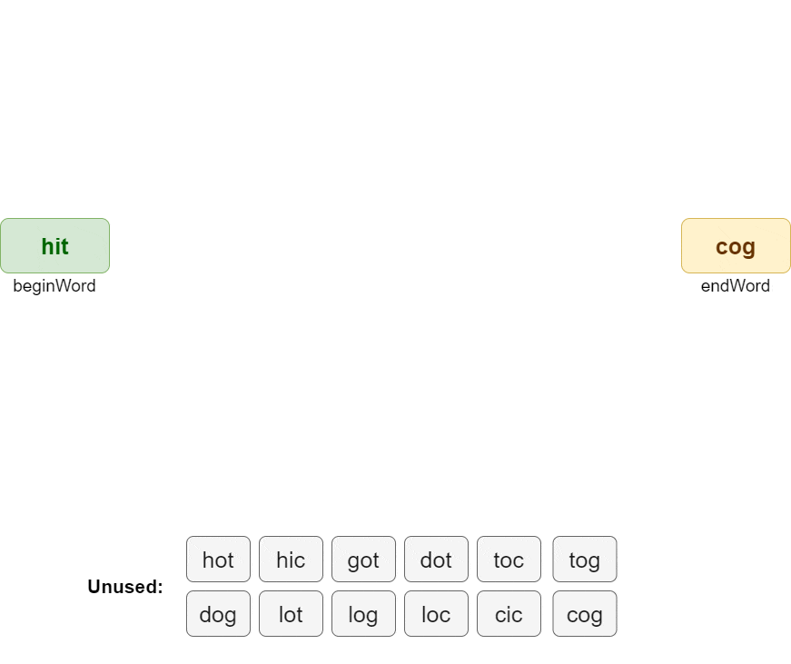

# Word Ladder II Solution

Possible solution to LeetCode problem: [126. Word Ladder II](https://leetcode.com/problems/word-ladder-ii/description)

## Problem Description

A **transformation sequence** from word `beginWord` to word `endWord` using a dictionary `wordList` is a sequence of
words `beginWord -> s1 -> s2 -> ... -> sk` such that:

- Every adjacent pair of words differs by a single letter.
- Every $s_i$ for `1 <= i <= k` is in `wordList`. Note that `beginWord` does not need to be in `wordList`.
- `sk == endWord`

Given two words, `beginWord` and `endWord`, and a dictionary `wordList`, return all the shortest transformation
sequences from
`beginWord` to `endWord`, or an empty list if no such sequence exists. Each sequence should be returned as a list of the
words `[beginWord, s1, s2, ..., sk]`.

### Example 1

```
Input: beginWord = "hit", endWord = "cog", wordList = ["hot","dot","dog","lot","log","cog"]
Output: [["hit","hot","dot","dog","cog"],["hit","hot","lot","log","cog"]]
Explanation: There are 2 shortest transformation sequences:
"hit" -> "hot" -> "dot" -> "dog" -> "cog"
"hit" -> "hot" -> "lot" -> "log" -> "cog"
```

### Example 2

```
Input: beginWord = "hit", endWord = "cog", wordList = ["hot","dot","dog","lot","log"]
Output: []
Explanation: The endWord "cog" is not in wordList, therefore there is no valid transformation sequence.
```

### Constraints

- `1 <= beginWord.length <= 5`
- `endWord.length == beginWord.length`
- `1 <= wordList.length <= 500`
- `wordList[i].length == beginWord.length`
- `beginWord`, `endWord`, and `wordList[i]` consist of lowercase English letters.
- `beginWord != endWord`
- All the words in `wordList` are unique.
- The sum of all shortest transformation sequences does not exceed $10^5$.

## Proposed solution

### Main idea

If we consider transformation sequences as the path from point `beginWord` to point `endWord`, then the problem reduces
to finding the shortest path. The [breadth-first search](https://en.wikipedia.org/wiki/Breadth-first_search) algorithm
is great for this purpose, but simply searching all possible paths from `beginWord` is not an optimal solution, since
not all paths will lead to `endWord`.

To reduce the number of dead-end paths to be processed, we propose an approach with sequential breadth-first search
starting from `beginWord` and `endWord` simultaneously until the intersection points of the paths are found.



### Finding adjacent pairs (neighbors)

Words are considered neighbors if they differ by a single letter. To quickly find all neighboring words, it is suggested
to pre-store `wordList` in **set collection**, and also save all possible letters **for each position** in word.

Thus, for each word it is possible to find a list of its neighbors, making a sequential search for words differing by
one
letter for each position.

#### Example

```
word: hot
wordSet: {hit, dot, dog, lot, log, cog}
positionLetters:
  0: {c, d, h, l}
  1: {i, o}
  2: {g, t}

neighbors by letter position 0:
    possible: cot, dot, lot
    existing: dot, lot
neighbors by letter position 1:
    possible: hit
    existing: hit
neighbors by letter position 2:
    possible: hog
    existing: no words

hot neighbors 🔥:
    {dot, lot, hit}

```

### Finding the shortest paths

To implement breadth-first search, **queue collection** will be used to store the order in which words are processed.

Since the search is performed from `beginWord` forward and `endWord` backward simultaneously, the following information
is stored for each processed word:

```python
from typing import NamedTuple


class QueuedWord(NamedTuple):
    word: str
    "Processed word"

    forward: bool
    "Search direction: forward/backward"

    level: int = 1
    "Level in path relative to beginning/end"
```

#### Storing word paths

To organize optimal storage of information about transformation sequences for each word, two dictionaries are used
`forwardWordTree` and `backwardWordTree`.

```python
from typing import Set, NamedTuple


class WordTreeNode(NamedTuple):
    """Word in hierarchy tree"""

    children: Set = set()
    "Child words in hierarchy tree"

    level: int = 1
    "Level in hierarchy tree"
```

Each dictionary is a hierarchical tree of paths from the beginning/end word to
the first path intersection. A word key stores a tree node that contains information about word level in path and a list
of its child adjacent words.

This method of storage solves several problems at once: reducing the memory used, since it does not store unnecessary
duplicate parts of paths for each word, and controlling the uniqueness of each word in the path to avoid infinite
loops.

##### Example

```
beginWord: hit
endWord: cog
wordSet: {hot, lot, log, cog}

forwardWordTree[hot]: level=1, children={hit}
forwardWordTree[lot]: level=2, children={hot}

backwardWordTree[log]: level=1, children={cog}
backwardWordTree[lot]: level=2, children={log}

lot is intersection point of path:
  hit -> hot -> lot -> log -> cog
```

#### Processing word in queue

Pairs of adjacent words with `beginWord` and `endWord` are added to queue before processing is started.

> If `endWord` is not in `wordList`, processing ends with an empty list result.

> If `beginWord` and `endWord` are adjacent, such a sequence is returned as the result and processing ends.

The processing of word in processing queue occurs in several steps:

- Checking [search completion condition](#search-completion-condition)
- Searching for adjacent words (neighbors)
- For each adjacent word found, a check is performed to ensure that the given word does not exist in the current path
  (to avoid infinite loops)
- If adjacent word does not exist in the current path but has already been processed in another path, this word is added
  to `forwardWordTree`/`backwardWordTree` as new path to processed word and the next word in queue is taken into
  processing
- If adjacent word was encountered for the first time, this word is also added to processing queue
- The next word in queue is taken into processing

#### Search completion condition

The processing of words in processing queue continues according to the algorithm described above until the first
intersection of `forwardWordTree` and `backwardWordTree` is encountered. After that, no new words are added to
processing queue.

Found word travel direction (forward/backward) and the word level in path relative to the beginning/end are
memorized, and all paths intersecting at that word are built by `forwardWordTree` and `backwardWordTree`.

Other words in processing queue, which are also path crossing points, are checked for equality of **word level** and
**travel direction** and their paths are also added to the result.

## LeetCode stats

### Runtime


### Memory

